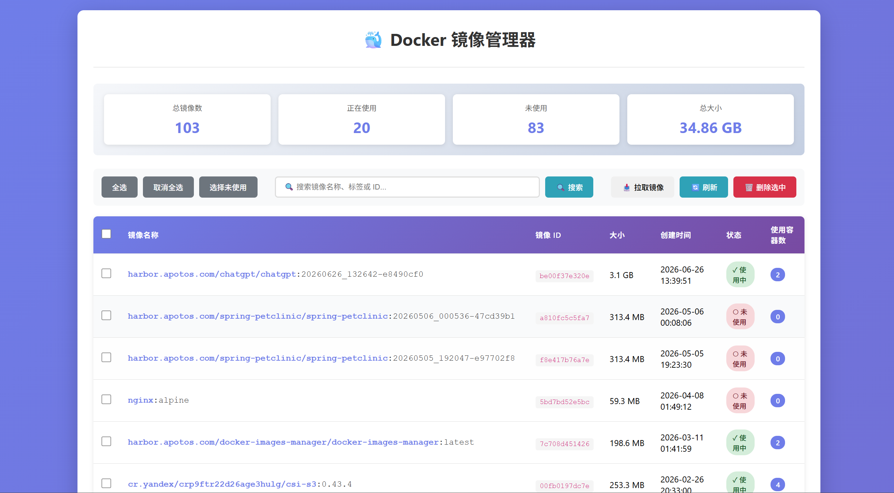

# Docker 镜像管理器

一个基于 Django 的 Docker 镜像管理工具，提供 Web 界面来查看和管理主机上的 Docker 镜像。



## 功能特性

- ✅ 列出所有 Docker 镜像
- ✅ 显示镜像详细信息（名称、ID、大小、创建时间）
- ✅ 显示镜像状态（是否正在被容器使用）
- ✅ 显示使用该镜像的容器数量
- ✅ 批量选择删除镜像
- ✅ 强制删除正在使用的镜像
- ✅ 实时刷新镜像列表
- ✅ 美观的响应式 UI 界面

## 系统要求

- Python 3.8+
- Docker
- Docker SDK for Python

## 安装步骤

### 1. 安装依赖

```bash
pip install -r requirements.txt
```

### 2. 数据库迁移

```bash
python manage.py makemigrations
python manage.py migrate
```

### 3. 运行服务

```bash
python manage.py runserver 0.0.0.0:8000
```

### 4. 访问应用

打开浏览器访问：http://localhost:8000

## 使用说明

### 查看镜像
- 首页会自动加载所有 Docker 镜像
- 显示镜像的详细信息：名称、ID、大小、创建时间
- 状态标识：绿色表示正在使用，红色表示未使用

### 删除镜像
1. 勾选要删除的镜像
2. 点击"删除选中"按钮
3. 在确认对话框中确认删除
4. 如果镜像正在被使用，可以选择"强制删除"

### 快捷选择
- **全选**：选择所有镜像
- **取消全选**：取消所有选择
- **选择未使用**：只选择未正在使用的镜像（推荐）

### 刷新列表
点击"刷新"按钮可以实时更新镜像列表，无需刷新整个页面。

## 项目结构

```
docker-images-manager/
├── docker_manager/          # Django 项目配置
│   ├── settings.py
│   ├── urls.py
│   └── wsgi.py
├── images/                  # 镜像管理应用
│   ├── templates/
│   │   └── images/
│   │       └── image_list.html
│   ├── docker_utils.py     # Docker 操作工具
│   ├── views.py            # 视图处理
│   ├── models.py           # 数据模型
│   └── urls.py             # URL 路由
├── static/                  # 静态文件
│   ├── css/
│   │   └── style.css
│   └── js/
│       └── main.js
├── manage.py
└── requirements.txt
```

## API 接口

### GET /
镜像列表页面

### POST /delete/
删除镜像
```json
{
    "image_ids": ["image_id1", "image_id2"],
    "force": false
}
```

### POST /refresh/
刷新镜像列表（AJAX）

## 注意事项

1. **Docker 权限**：确保运行 Django 的用户有权限访问 Docker 守护进程
2. **生产环境**：在生产环境中使用时，请修改 `SECRET_KEY` 并设置合适的 `ALLOWED_HOSTS`
3. **强制删除**：强制删除正在使用的镜像可能导致容器运行异常，请谨慎使用
4. **安全性**：默认允许所有主机访问，生产环境请限制 `ALLOWED_HOSTS`

## 故障排除

### 无法连接到 Docker
错误信息：`无法连接到 Docker 守护进程`
- 确认 Docker 服务正在运行
- 检查当前用户是否有 Docker 权限

### 权限错误
- 将用户添加到 docker 组：`sudo usermod -aG docker $USER`
- 重新登录后生效

## 技术栈

- **后端**: Django 4.2+
- **Docker 交互**: docker-py 6.0+
- **前端**: 原生 JavaScript + CSS3
- **数据库**: SQLite（默认）

## 许可证

MIT License
